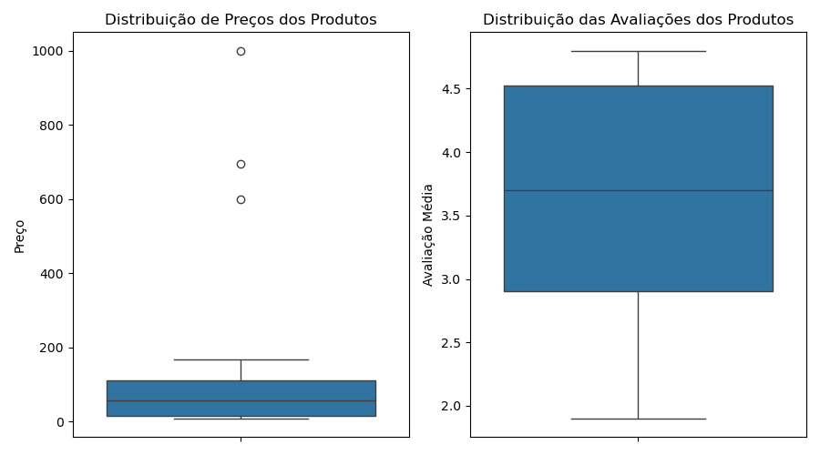
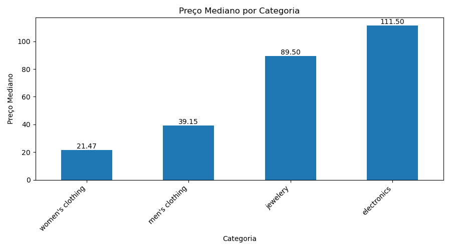
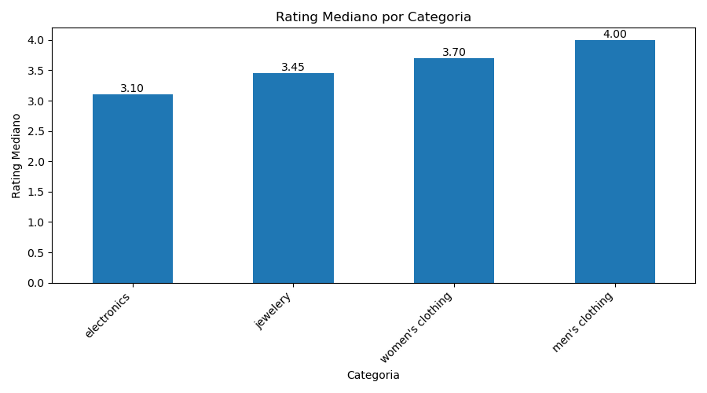
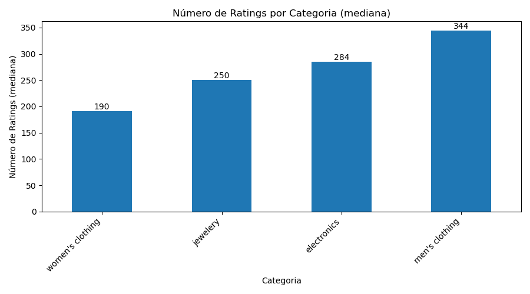
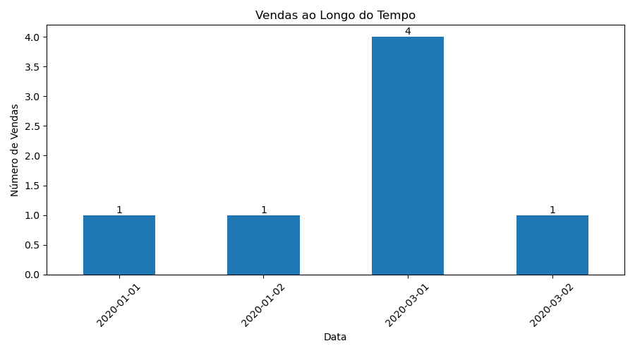
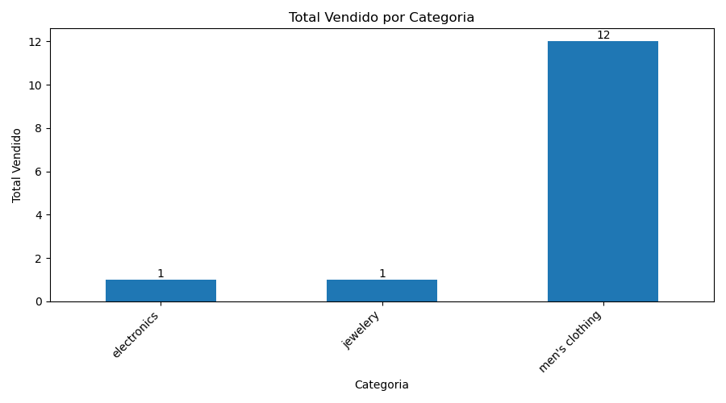
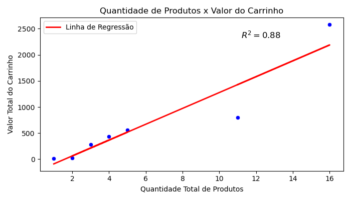

# **API Data Analysis**
Analyzing data from a public API.

# **Objectives**

- **Data Access and Consumption:** Write a script in Python or another suitable language to access data from the selected API.
- **Exploratory Analysis:** Conduct an exploratory analysis of the data to uncover patterns, trends, and useful information. This should include the use of descriptive statistics and the creation of visualizations such as bar charts, line graphs, and possibly maps if the data includes geographic information.
- **Insights Report:** Produce a document or presentation that highlights the key insights obtained from the analysis, emphasizing data visualizations that support these insights.

# **Metodology**

The following steps were carried out:

1. **Data Loading**: I accessed the datasets through the 'Fake Store API' at the provided [URL](https://fakestoreapi.com) and saved the data as CSV files locally.
2. **Data Cleaning and Preparation**: I checked for null values, duplicate rows, and column types. Some columns were split to facilitate insight extraction (e.g., the address column).
3. **Exploratory Analysis**: This is the core of the project. I formulated relevant questions for the business team and sought to answer them by analyzing the datasets.
4. **Conclusion**: A report of insights was prepared in the project's 'README' file to facilitate consultation and visualization for interested parties.

# **Results**
## **Products**
### Prices and Ratings Distribution




**Price Quartiles**

| Quartile | Price |
|----------|-------|
| 25%      | 15.24 |
| 50%      | 56.49 |
| 75%      | 110.96 |

**Rating Quartiles**

| Quartile | Rating |
|----------|--------|
| 25%      | 2.90   |
| 50%      | 3.70   |
| 75%      | 4.53   |

### Median Prices per Category



### Median Rating per Category



### Categories with most Rates



### Highest Rated Products

| Title                                                     | Weighted Rating |
|-----------------------------------------------------------|-----------------|
| WD 4TB Gaming Drive Works with Playstation 4            | 4.8             |
| Silicon Power 256GB SSD 3D NAND A55 SLC Cache            | 4.8             |
| Mens Cotton Jacket                                       | 4.7             |
| MBJ Women's Solid Short Sleeve Boat Neck V               | 4.7             |
| John Hardy Women's Legends Naga Gold & Silver Dragon Ring | 4.6             |

## **Carts**

### Total Sales in the Period



### Total Sold by Category



### Median Number of Items per Cart
There were 4 products per cart.

### Average Price per Cart
Average price ber cart was $670.18

### Correlation between Price per Cart and Number of Items per cart



The correlation between price per cart and number of items per cart is: 0.94

# **References**
- **FakeStore API:** https://fakestoreapi.com/
- **Nominatim usage policy:** https://operations.osmfoundation.org/policies/nominatim/

# **Reproducing this study**

1. Clone repo
```bash 
git clone https://github.com/joaomj/api_data_analysis.git
```

2. Create virtual environment for this  (i used *miniconda* as my virtual environment management system)

```bash 
conda create --name <environment_name>
```

3. Install dependencies

```bash 
conda install --yes --file requirements.txt
```

4. Run jupyter notebook (*i used VS Code with Jupyter Notebook extension*)

# **Contact**
- **Tech Lead:** João Marcos - ([Linkedin](https://www.linkedin.com/in/joaomj))
- Give me one **star** if you liked it!